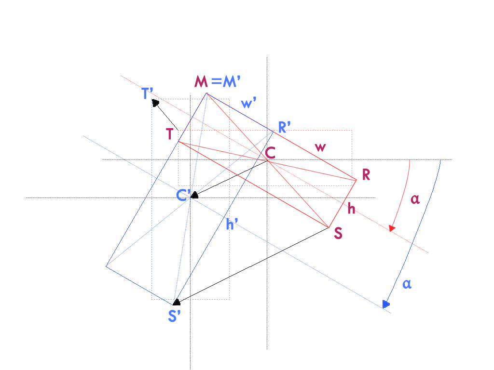

# Move, Resize, Rotate

## Drag & Drop

Drag and drop is extensively explained at:

- http://www.html5rocks.com/en/tutorials/dnd/basics/
- http://www.html5laboratory.com/drag-and-drop.php
- http://stackoverflow.com/questions/11529788/html-5-drag-events
- http://stackoverflow.com/questions/5500615/internet-explorer-9-drag-and-drop-dnd
- http://nettutsplus.s3.amazonaws.com/64_html5dragdrop/demo/index.html
- http://github.com/guillaumebort/jquery-ndd

We are not using HTML 5 drag events which have mixed success across browsers.
We are using mousedown/touchstart, mouseover/touchmove and mouseup/touchend.  

## Move

Moving a widget (or shape) is easy.
Simply use the mouse coordinates to update (top, left) styles.
We are not using CSS translate despite http://www.paulirish.com/2012/why-moving-elements-with-translate-is-better-than-posabs-topleft/.
In our opinion, CSS translate should be preferred for animations, not for fixed positions.
Also the order of CSS transforms (translate, rotate, scale) has implications. Having only one CSS transform (rotate) discards any ambiguities.
We might consider changing that in the future.

## Resize

Sizing a widget (or shape) is the tricky bit.
The complexity is better explained on the following diagram:

The rectangle before resizing is displayed in red. The same rectangle after resizing is displayed in blue.
The rectangle is rotated by an angle alpha which remains constant as a user resizes this rectangle.
Solid rectangles represent rotated rectangles. Dotted rectangles are the same rectangles before applying the rotation.
The M=M' handle remains at the same position through resizing with the S handle.
The mouse drags the S handle form S to S' so that the height and width change from (h,w) to (h',w').
The top and left attributes define T which is the position of the M handle before the rotation.
After resizing, S has moved to S', C (center of rotation) has moved to C' and T has move to T'.
So sizing requires that we calculate top, left, height and width if we want to keep M=M'.

To find T' (the new top and left):
1. we need to rotate T around C by an alpha angle to find M
2. we then need to rotate M around C' by a -alpha angle to find T'

The maths to rotate a point by an angle are well explained at:

- http://stackoverflow.com/questions/2259476/rotating-a-point-about-another-point-2d
- http://www.felixeve.co.uk/how-to-rotate-a-point-around-an-origin-with-javascript/

## Rotate

Rotating a widget (or shape) is also easy.
Simply use the mouse coordinates and the center of rotation to calculate the rotation angle.

The maths to find the angle between two points from a center aer well explained at:

- http://www.euclideanspace.com/maths/algebra/vectors/angleBetween/
- http://stackoverflow.com/questions/7586063/how-to-calculate-the-angle-between-a-line-and-the-horizontal-axis
- http://code.tutsplus.com/tutorials/euclidean-vectors-in-flash--active-8192
- http://gamedev.stackexchange.com/questions/69649/using-atan2-to-calculate-angle-between-two-vectors

This is the only CSS transform that we use for widgets (shapes) since moving uses (top, left) and sizing uses (height, width).
